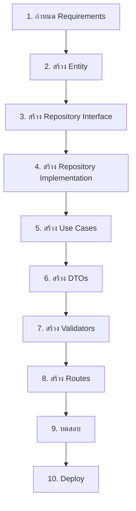

# Development Guide - Clean Architecture

คู่มือการพัฒนา Feature ใหม่บนโปรเจค Clean Architecture แบบ Step-by-Step

---

## 📋 สารบัญ

1. [แนวคิดพื้นฐาน](#แนวคิดพื้นฐาน)
2. [ขั้นตอนการพัฒนา Feature](#ขั้นตอนการพัฒนา-feature)
3. [ตัวอย่าง: Todo List Feature](#ตัวอย่าง-todo-list-feature)
4. [Best Practices](#best-practices)
5. [Testing Guide](#testing-guide)

---

## แนวคิดพื้นฐาน

### Clean Architecture Layers

การพัฒนา Feature ใหม่ต้องทำงานจากใน (Domain) ออกนอก (Presentation):

```
1. Domain Layer       → Business Logic & Interfaces
2. Infrastructure     → Implementation & Database
3. Application Layer  → Use Cases & DTOs
4. Presentation       → Routes & Controllers
```

### Development Flow



---

## 🔗 การเชื่อมโยงระหว่างไฟล์

### ภาพรวมการทำงานของระบบ

```
┌─────────────────────────────────────────────────────────────┐
│                      HTTP Request                           │
│                   POST /api/todos                           │
└──────────────────────────┬──────────────────────────────────┘
                           │
                           ▼
┌─────────────────────────────────────────────────────────────┐
│                    routes/todos.php                         │
│  - รับ Request                                              │
│  - ดึง TodoValidator จาก Container                         │
│  - Validate ข้อมูล                                         │
│  - ดึง CreateTodoUseCase จาก Container                    │
└──────────────────────────┬──────────────────────────────────┘
                           │
                           ▼
┌─────────────────────────────────────────────────────────────┐
│         Application/DTOs/CreateTodoRequest.php              │
│  - สร้าง DTO Object จากข้อมูล Request                     │
│  - ส่งต่อไปยัง Use Case                                    │
└──────────────────────────┬──────────────────────────────────┘
                           │
                           ▼
┌─────────────────────────────────────────────────────────────┐
│       Application/UseCases/Todo/CreateTodoUseCase.php       │
│  - รับ DTO                                                  │
│  - สร้าง Todo Entity                                       │
│  - เรียก TodoRepository->save()                            │
└──────────────────────────┬──────────────────────────────────┘
                           │
                           ▼
┌─────────────────────────────────────────────────────────────┐
│              Domain/Entities/Todo.php                       │
│  - สร้าง Object จาก Constructor                           │
│  - ใช้ Business Methods (validation)                       │
│  - ส่ง Object ไปยัง Repository                            │
└──────────────────────────┬──────────────────────────────────┘
                           │
                           ▼
┌─────────────────────────────────────────────────────────────┐
│    Domain/Repositories/TodoRepositoryInterface.php          │
│  - กำหนด Contract (Interface)                              │
│  - TodoRepository ต้อง implement                           │
└──────────────────────────┬──────────────────────────────────┘
                           │
                           ▼
┌─────────────────────────────────────────────────────────────┐
│      Infrastructure/Persistence/TodoRepository.php          │
│  - implement TodoRepositoryInterface                        │
│  - save() -> INSERT ลง Database                            │
│  - mapToEntity() -> แปลง row เป็น Todo Entity             │
│  - return Todo Entity                                       │
└──────────────────────────┬──────────────────────────────────┘
                           │
                           ▼
┌─────────────────────────────────────────────────────────────┐
│                       Database                              │
│                    (SQL Server)                             │
│              INSERT INTO todos...                           │
└──────────────────────────┬──────────────────────────────────┘
                           │
                           ▼ (Response กลับไป)
┌─────────────────────────────────────────────────────────────┐
│                    JSON Response                            │
│  {                                                          │
│    "message": "Todo created successfully",                  │
│    "todo": { ... }                                          │
│  }                                                          │
└─────────────────────────────────────────────────────────────┘
```

### การเชื่อมโยงแบบละเอียด

#### 1. **Route → Validator → Use Case**

**routes/todos.php:**
```php
$app->post('/', function () use ($app) {
    $data = json_decode($app->request->getBody(), true);
    
    // ① เรียกใช้ Validator จาก DI Container
    $validator = $app->container['TodoValidator'];
    $errors = $validator->validateCreate($data);
    
    // ② เรียกใช้ Use Case จาก DI Container
    $useCase = $app->container['CreateTodoUseCase'];
    
    // ③ สร้าง DTO และส่งให้ Use Case
    $request = new CreateTodoRequest(...);
    $todo = $useCase->execute($request);
});
```

**การทำงาน:**
1. Route รับ HTTP Request
2. ดึง Validator และ Use Case จาก Container
3. สร้าง DTO และเรียก Use Case
4. Use Case return Entity กลับมา
5. Route แปลง Entity เป็น JSON Response

---

#### 2. **Use Case → Entity → Repository**

**Application/UseCases/Todo/CreateTodoUseCase.php:**
```php
class CreateTodoUseCase
{
    private $todoRepository;  // ① Dependency Injection
    
    public function __construct(TodoRepositoryInterface $todoRepository)
    {
        $this->todoRepository = $todoRepository;
    }
    
    public function execute(CreateTodoRequest $request): Todo
    {
        // ② สร้าง Entity
        $todo = new Todo(
            $request->userId,
            $request->title,
            $request->description
        );
        
        // ③ เรียก Repository เพื่อบันทึก
        return $this->todoRepository->save($todo);
    }
}
```

**การทำงาน:**
1. Use Case รับ TodoRepositoryInterface ผ่าน Constructor
2. สร้าง Todo Entity จาก DTO
3. เรียก Repository->save() โดยส่ง Entity เข้าไป
4. Repository return Entity ที่มี ID กลับมา
5. Use Case return Entity ให้ Route

---

#### 3. **Entity → Business Logic**

**Domain/Entities/Todo.php:**
```php
class Todo
{
    private $title;
    private $completed;
    
    public function __construct(int $userId, string $title, ...)
    {
        // ① Validation ใน Constructor
        if (strlen($title) < 3) {
            throw new InvalidArgumentException('Title too short');
        }
        $this->title = $title;
        $this->completed = false;
    }
    
    // ② Business Methods
    public function markAsCompleted(): void
    {
        $this->completed = true;
    }
    
    public function updateTitle(string $title): void
    {
        // ③ Validation ใน Business Method
        if (strlen($title) < 3) {
            throw new InvalidArgumentException('Title too short');
        }
        $this->title = $title;
    }
}
```

**การทำงาน:**
1. Entity เก็บ Business Logic และ Rules
2. Constructor validate ข้อมูลตอนสร้าง
3. Business Methods จัดการการเปลี่ยนแปลง State
4. Entity ไม่รู้จัก Database, HTTP, Framework

---

#### 4. **Repository Interface → Implementation**

**Domain/Repositories/TodoRepositoryInterface.php:**
```php
interface TodoRepositoryInterface
{
    public function save(Todo $todo): Todo;
    public function findById(int $id): ?Todo;
    // ... methods อื่นๆ
}
```

**Infrastructure/Persistence/TodoRepository.php:**
```php
class TodoRepository implements TodoRepositoryInterface
{
    // ① Implement Interface
    public function save(Todo $todo): Todo
    {
        // ② INSERT ลง Database
        $id = DB::table('todos')->insertGetId([
            'user_id' => $todo->getUserId(),
            'title' => $todo->getTitle(),
            // ...
        ]);
        
        // ③ Query ข้อมูลกลับมา
        return $this->findById($id);
    }
    
    public function findById(int $id): ?Todo
    {
        // ④ SELECT จาก Database
        $row = DB::table('todos')->where('id', $id)->first();
        
        // ⑤ แปลง row เป็น Entity
        return $this->mapToEntity($row);
    }
    
    private function mapToEntity($row): Todo
    {
        // ⑥ สร้าง Entity จากข้อมูล Database
        return new Todo(
            (int) $row->user_id,
            $row->title,
            $row->description,
            (bool) $row->completed,
            (int) $row->id
        );
    }
}
```

**การทำงาน:**
1. Repository implement Interface จาก Domain
2. แปลง Entity เป็น Array/Data สำหรับ Database
3. Execute SQL Command (INSERT, UPDATE, DELETE)
4. Query ข้อมูลกลับมาจาก Database
5. แปลง Database Row เป็น Entity
6. Return Entity กลับไปยัง Use Case

---

#### 5. **Dependency Injection Container**

**bootstrap/dependencies.php:**
```php
// ① Register Repository
$container['TodoRepository'] = function ($c) {
    return new TodoRepository();
};

// ② Register Validator
$container['TodoValidator'] = function ($c) {
    return new TodoValidator();
};

// ③ Register Use Case (inject Repository)
$container['CreateTodoUseCase'] = function ($c) {
    return new CreateTodoUseCase(
        $c['TodoRepository']  // ← Inject Dependency
    );
};
```

**การทำงาน:**
1. Register classes ใน Container
2. Use Case ต้องการ Repository → inject ผ่าน Constructor
3. Route เรียกใช้ Use Case จาก Container
4. Container สร้าง instance และ inject dependencies อัตโนมัติ

---

### Flow การ Create Todo (ตัวอย่างสมบูรณ์)

```
📱 Client ส่ง Request
    │
    ▼
┌─────────────────────────────────────────────────┐
│  POST /api/todos                                │
│  {                                              │
│    "title": "Buy milk",                         │
│    "description": "From supermarket"            │
│  }                                              │
└────────────────────┬────────────────────────────┘
                     │
                     ▼
┌─────────────────────────────────────────────────┐
│  routes/todos.php                               │
│  ① Parse JSON Request Body                     │
│  ② Get TodoValidator from Container            │
│  ③ Validate input                              │
│  ④ Get CreateTodoUseCase from Container        │
└────────────────────┬────────────────────────────┘
                     │
                     ▼
┌─────────────────────────────────────────────────┐
│  Application/DTOs/CreateTodoRequest.php         │
│  ⑤ Create DTO Object                           │
│     - userId: 1                                 │
│     - title: "Buy milk"                         │
│     - description: "From supermarket"           │
└────────────────────┬────────────────────────────┘
                     │
                     ▼
┌─────────────────────────────────────────────────┐
│  Application/UseCases/CreateTodoUseCase.php     │
│  ⑥ Receive DTO                                 │
│  ⑦ Create new Todo Entity                      │
│  ⑧ Call todoRepository->save($todo)            │
└────────────────────┬────────────────────────────┘
                     │
                     ▼
┌─────────────────────────────────────────────────┐
│  Domain/Entities/Todo.php                       │
│  ⑨ Constructor validates title (>= 3 chars)    │
│  ⑩ Set properties                              │
│  ⑪ Return Todo object to Use Case              │
└────────────────────┬────────────────────────────┘
                     │
                     ▼
┌─────────────────────────────────────────────────┐
│  Infrastructure/Persistence/TodoRepository.php  │
│  ⑫ Implement save() method                     │
│  ⑬ Extract data from Todo Entity               │
│  ⑭ DB::table('todos')->insertGetId([...])      │
│  ⑮ Get new ID                                  │
│  ⑯ Call findById() to get complete Todo        │
└────────────────────┬────────────────────────────┘
                     │
                     ▼
┌─────────────────────────────────────────────────┐
│  Infrastructure/Persistence/TodoRepository.php  │
│  ⑰ SELECT * FROM todos WHERE id = ?            │
│  ⑱ Get database row                            │
│  ⑲ Call mapToEntity($row)                      │
└────────────────────┬────────────────────────────┘
                     │
                     ▼
┌─────────────────────────────────────────────────┐
│  Domain/Entities/Todo.php                       │
│  ⑳ Create new Todo with ID from database       │
│  ㉑ Return complete Todo Entity                 │
└────────────────────┬────────────────────────────┘
                     │
                     ▼
┌─────────────────────────────────────────────────┐
│  routes/todos.php                               │
│  ㉒ Receive Todo Entity from Use Case           │
│  ㉓ Convert to Array: $todo->toArray()          │
│  ㉔ Encode to JSON                              │
│  ㉕ Set HTTP Status 201 Created                 │
└────────────────────┬────────────────────────────┘
                     │
                     ▼
📱 Client รับ Response
{
  "message": "Todo created successfully",
  "todo": {
    "id": 1,
    "user_id": 1,
    "title": "Buy milk",
    "description": "From supermarket",
    "completed": false,
    "created_at": "2024-01-01 12:00:00"
  }
}
```

---

### Flow การ Update Todo

```
📱 PUT /api/todos/1
{
  "title": "Buy milk and eggs",
  "completed": true
}
    │
    ▼
routes/todos.php
    │ ① Get UpdateTodoUseCase
    │ ② Validate input
    │ ③ Create UpdateTodoRequest DTO
    ▼
UpdateTodoUseCase
    │ ④ Call todoRepository->findById(1)
    │ ⑤ If not found → throw TodoNotFoundException
    ▼
TodoRepository
    │ ⑥ SELECT * FROM todos WHERE id = 1
    │ ⑦ mapToEntity($row) → return Todo Entity
    ▼
UpdateTodoUseCase
    │ ⑧ Check if title changed → $todo->updateTitle()
    │ ⑨ Check if completed changed → $todo->markAsCompleted()
    ▼
Todo Entity
    │ ⑩ updateTitle() validates and updates
    │ ⑪ markAsCompleted() changes state
    ▼
UpdateTodoUseCase
    │ ⑫ Call todoRepository->update($todo)
    ▼
TodoRepository
    │ ⑬ UPDATE todos SET ... WHERE id = 1
    │ ⑭ Call findById() to get updated Todo
    ▼
routes/todos.php
    │ ⑮ Return JSON Response
    ▼
📱 Client รับ Response
```

---

### การเชื่อมโยงผ่าน Dependency Injection

```php
// ① Register ใน Container
$container['TodoRepository'] = function ($c) {
    return new TodoRepository();
};

$container['CreateTodoUseCase'] = function ($c) {
    return new CreateTodoUseCase(
        $c['TodoRepository']  // ← Auto inject
    );
};

// ② ใช้งานใน Route
$app->post('/todos', function () use ($app) {
    // ③ Container จะสร้าง instance และ inject dependencies
    $useCase = $app->container['CreateTodoUseCase'];
    
    // ④ ตอนนี้ $useCase มี TodoRepository อยู่ในตัวแล้ว
    $todo = $useCase->execute($request);
});
```

**ข้อดีของ DI:**
- ไม่ต้อง `new` class ในทุกที่
- เปลี่ยน implementation ได้ง่าย (เช่น เปลี่ยนจาก SQL Server เป็น MySQL)
- Testing ง่ายขึ้น (inject Mock Repository)

---

### ความสัมพันธ์ระหว่าง Layers

```
┌─────────────────────────────────────────────────┐
│              Presentation Layer                 │
│  routes/todos.php                               │
│  - ต้องการ: Validator, Use Cases               │
│  - เรียกผ่าน: DI Container                      │
│  - ส่งต่อ: DTO                                  │
│  - รับกลับ: Entity                              │
└─────────────────┬───────────────────────────────┘
                  │ calls
                  ▼
┌─────────────────────────────────────────────────┐
│             Application Layer                   │
│  Use Cases: CreateTodoUseCase                   │
│  DTOs: CreateTodoRequest                        │
│  Validators: TodoValidator                      │
│  - ต้องการ: Repository Interface               │
│  - เรียกผ่าน: Constructor (DI)                 │
│  - สร้าง: Entity                                │
│  - เรียก: Repository methods                    │
└─────────────────┬───────────────────────────────┘
                  │ uses
                  ▼
┌─────────────────────────────────────────────────┐
│               Domain Layer                      │
│  Entities: Todo                                 │
│  Interfaces: TodoRepositoryInterface            │
│  Exceptions: TodoNotFoundException              │
│  - ไม่ขึ้นกับ: Layer อื่นๆ                      │
│  - กำหนด: Business Rules                        │
│  - ให้: Interface สำหรับ Infrastructure         │
└─────────────────┬───────────────────────────────┘
                  │ implements
                  ▼
┌─────────────────────────────────────────────────┐
│           Infrastructure Layer                  │
│  Persistence: TodoRepository                    │
│  - implement: TodoRepositoryInterface           │
│  - เชื่อมต่อ: Database                          │
│  - แปลง: Database Row ↔ Entity                 │
└─────────────────────────────────────────────────┘
```

---

### ตารางสรุปการเชื่อมโยง

| ไฟล์ | ต้องการ/ใช้ | ส่งให้/Return | Role |
|------|-------------|---------------|------|
| **routes/todos.php** | Validator, Use Case (จาก Container) | JSON Response | รับ HTTP, เรียก Use Case |
| **CreateTodoRequest.php** | - | DTO Object | ห่อหุ้มข้อมูล Request |
| **CreateTodoUseCase.php** | TodoRepositoryInterface | Todo Entity | Business Logic Flow |
| **Todo.php** | - | Entity Object | Business Rules & Data |
| **TodoRepositoryInterface.php** | - | Contract/Interface | กำหนด methods ที่ต้อง implement |
| **TodoRepository.php** | Database Connection | Todo Entity | Database Operations |
| **TodoValidator.php** | Input Data | Array of Errors | Validation Logic |
| **dependencies.php** | All Classes | Configured Container | DI Configuration |

---

### สรุป: ทำไมต้องแยกไฟล์?

#### ✅ **Separation of Concerns**
- แต่ละไฟล์มีหน้าที่ชัดเจน
- แก้ไขง่าย ไม่กระทบส่วนอื่น

#### ✅ **Testability**
- Test แต่ละส่วนแยกกันได้
- Mock dependencies ได้ง่าย

#### ✅ **Maintainability**
- เปลี่ยน Database → แก้แค่ Repository
- เปลี่ยน Validation → แก้แค่ Validator
- เพิ่ม Business Rule → แก้แค่ Entity

#### ✅ **Reusability**
- Use Case เดียวกันใช้ได้หลาย Route
- Entity เดียวกันใช้ได้หลาย Use Case
- Repository เดียวกันใช้ได้หลาย Use Case

---

## ขั้นตอนการพัฒนา Feature

### Step 1: วิเคราะห์ Requirements

ก่อนเขียนโค้ด ต้องถามตัวเองก่อน:

- ✅ Entity/Model มีอะไรบ้าง?
- ✅ Properties ของแต่ละ Entity คืออะไร?
- ✅ Business Rules คืออะไร?
- ✅ มี Validation อะไรบ้าง?
- ✅ Use Cases มีอะไรบ้าง? (CRUD หรือมากกว่า?)
- ✅ ต้องการ API Endpoints อะไรบ้าง?

### Step 2: สร้าง Domain Layer

เริ่มจาก **Domain** เพราะเป็นหัวใจของ Business Logic

#### 2.1 สร้าง Entity

**Path:** `app/Domain/Entities/`

```php
<?php
// app/Domain/Entities/Todo.php

namespace App\Domain\Entities;

class Todo
{
    private $id;
    private $userId;
    private $title;
    private $description;
    private $completed;
    private $createdAt;
    private $updatedAt;

    public function __construct(
        int $userId,
        string $title,
        ?string $description = null,
        bool $completed = false,
        ?int $id = null,
        ?string $createdAt = null,
        ?string $updatedAt = null
    ) {
        $this->id = $id;
        $this->userId = $userId;
        $this->title = $title;
        $this->description = $description;
        $this->completed = $completed;
        $this->createdAt = $createdAt;
        $this->updatedAt = $updatedAt;
    }

    // Getters
    public function getId(): ?int { return $this->id; }
    public function getUserId(): int { return $this->userId; }
    public function getTitle(): string { return $this->title; }
    public function getDescription(): ?string { return $this->description; }
    public function isCompleted(): bool { return $this->completed; }
    public function getCreatedAt(): ?string { return $this->createdAt; }
    public function getUpdatedAt(): ?string { return $this->updatedAt; }

    // Business Methods
    public function markAsCompleted(): void
    {
        $this->completed = true;
    }

    public function markAsIncomplete(): void
    {
        $this->completed = false;
    }

    public function updateTitle(string $title): void
    {
        if (strlen($title) < 3) {
            throw new \InvalidArgumentException('Title must be at least 3 characters');
        }
        $this->title = $title;
    }

    public function toArray(): array
    {
        return [
            'id' => $this->id,
            'user_id' => $this->userId,
            'title' => $this->title,
            'description' => $this->description,
            'completed' => $this->completed,
            'created_at' => $this->createdAt,
            'updated_at' => $this->updatedAt,
        ];
    }
}
```

#### 2.2 สร้าง Repository Interface

**Path:** `app/Domain/Repositories/`

```php
<?php
// app/Domain/Repositories/TodoRepositoryInterface.php

namespace App\Domain\Repositories;

use App\Domain\Entities\Todo;

interface TodoRepositoryInterface
{
    public function findById(int $id): ?Todo;
    public function findByUserId(int $userId): array;
    public function save(Todo $todo): Todo;
    public function update(Todo $todo): Todo;
    public function delete(int $id): bool;
    public function markAsCompleted(int $id): bool;
}
```

#### 2.3 สร้าง Domain Exceptions (ถ้าจำเป็น)

**Path:** `app/Domain/Exceptions/`

```php
<?php
// app/Domain/Exceptions/TodoNotFoundException.php

namespace App\Domain\Exceptions;

class TodoNotFoundException extends \Exception
{
    public function __construct(int $id)
    {
        parent::__construct("Todo with ID {$id} not found");
    }
}
```

### Step 3: สร้าง Infrastructure Layer

#### 3.1 สร้าง Repository Implementation

**Path:** `app/Infrastructure/Persistence/`

```php
<?php
// app/Infrastructure/Persistence/TodoRepository.php

namespace App\Infrastructure\Persistence;

use App\Domain\Entities\Todo;
use App\Domain\Repositories\TodoRepositoryInterface;
use App\Domain\Exceptions\TodoNotFoundException;
use Illuminate\Database\Capsule\Manager as DB;

class TodoRepository implements TodoRepositoryInterface
{
    private $table = 'todos';

    public function findById(int $id): ?Todo
    {
        $row = DB::table($this->table)->where('id', $id)->first();
        
        if (!$row) {
            return null;
        }
        
        return $this->mapToEntity($row);
    }

    public function findByUserId(int $userId): array
    {
        $rows = DB::table($this->table)
            ->where('user_id', $userId)
            ->orderBy('created_at', 'desc')
            ->get();
        
        return array_map([$this, 'mapToEntity'], $rows);
    }

    public function save(Todo $todo): Todo
    {
        $id = DB::table($this->table)->insertGetId([
            'user_id' => $todo->getUserId(),
            'title' => $todo->getTitle(),
            'description' => $todo->getDescription(),
            'completed' => $todo->isCompleted(),
            'created_at' => date('Y-m-d H:i:s'),
            'updated_at' => date('Y-m-d H:i:s'),
        ]);

        return $this->findById($id);
    }

    public function update(Todo $todo): Todo
    {
        DB::table($this->table)
            ->where('id', $todo->getId())
            ->update([
                'title' => $todo->getTitle(),
                'description' => $todo->getDescription(),
                'completed' => $todo->isCompleted(),
                'updated_at' => date('Y-m-d H:i:s'),
            ]);

        return $this->findById($todo->getId());
    }

    public function delete(int $id): bool
    {
        return DB::table($this->table)->where('id', $id)->delete() > 0;
    }

    public function markAsCompleted(int $id): bool
    {
        return DB::table($this->table)
            ->where('id', $id)
            ->update(['completed' => true, 'updated_at' => date('Y-m-d H:i:s')]) > 0;
    }

    private function mapToEntity($row): Todo
    {
        return new Todo(
            (int) $row->user_id,
            $row->title,
            $row->description,
            (bool) $row->completed,
            (int) $row->id,
            $row->created_at,
            $row->updated_at
        );
    }
}
```

#### 3.2 สร้าง Database Migration

**Path:** `database/migrations/`

```php
<?php
// database/migrations/create_todos_table.php

use Illuminate\Database\Capsule\Manager as DB;

// Run this migration
DB::schema()->create('todos', function ($table) {
    $table->increments('id');
    $table->integer('user_id');
    $table->string('title', 255);
    $table->text('description')->nullable();
    $table->boolean('completed')->default(false);
    $table->timestamps();
    
    // Foreign key
    $table->foreign('user_id')->references('id')->on('users')->onDelete('cascade');
    
    // Indexes
    $table->index('user_id');
    $table->index('completed');
});
```

**SQL Server Version:**
```sql
-- database/migrations/create_todos_table.sql

CREATE TABLE todos (
    id INT IDENTITY(1,1) PRIMARY KEY,
    user_id INT NOT NULL,
    title NVARCHAR(255) NOT NULL,
    description NVARCHAR(MAX),
    completed BIT DEFAULT 0,
    created_at DATETIME DEFAULT GETDATE(),
    updated_at DATETIME DEFAULT GETDATE(),
    
    FOREIGN KEY (user_id) REFERENCES users(id) ON DELETE CASCADE
);

CREATE INDEX idx_todos_user_id ON todos(user_id);
CREATE INDEX idx_todos_completed ON todos(completed);
```

### Step 4: สร้าง Application Layer

#### 4.1 สร้าง DTOs (Data Transfer Objects)

**Path:** `app/Application/DTOs/`

```php
<?php
// app/Application/DTOs/CreateTodoRequest.php

namespace App\Application\DTOs;

class CreateTodoRequest
{
    public $userId;
    public $title;
    public $description;

    public function __construct(int $userId, string $title, ?string $description = null)
    {
        $this->userId = $userId;
        $this->title = $title;
        $this->description = $description;
    }
}
```

```php
<?php
// app/Application/DTOs/UpdateTodoRequest.php

namespace App\Application\DTOs;

class UpdateTodoRequest
{
    public $id;
    public $title;
    public $description;
    public $completed;

    public function __construct(int $id, ?string $title = null, ?string $description = null, ?bool $completed = null)
    {
        $this->id = $id;
        $this->title = $title;
        $this->description = $description;
        $this->completed = $completed;
    }
}
```

#### 4.2 สร้าง Use Cases

**Path:** `app/Application/UseCases/Todo/`

```php
<?php
// app/Application/UseCases/Todo/CreateTodoUseCase.php

namespace App\Application\UseCases\Todo;

use App\Domain\Entities\Todo;
use App\Domain\Repositories\TodoRepositoryInterface;
use App\Application\DTOs\CreateTodoRequest;

class CreateTodoUseCase
{
    private $todoRepository;

    public function __construct(TodoRepositoryInterface $todoRepository)
    {
        $this->todoRepository = $todoRepository;
    }

    public function execute(CreateTodoRequest $request): Todo
    {
        $todo = new Todo(
            $request->userId,
            $request->title,
            $request->description
        );

        return $this->todoRepository->save($todo);
    }
}
```

```php
<?php
// app/Application/UseCases/Todo/GetUserTodosUseCase.php

namespace App\Application\UseCases\Todo;

use App\Domain\Repositories\TodoRepositoryInterface;

class GetUserTodosUseCase
{
    private $todoRepository;

    public function __construct(TodoRepositoryInterface $todoRepository)
    {
        $this->todoRepository = $todoRepository;
    }

    public function execute(int $userId): array
    {
        return $this->todoRepository->findByUserId($userId);
    }
}
```

```php
<?php
// app/Application/UseCases/Todo/UpdateTodoUseCase.php

namespace App\Application\UseCases\Todo;

use App\Domain\Entities\Todo;
use App\Domain\Repositories\TodoRepositoryInterface;
use App\Application\DTOs\UpdateTodoRequest;
use App\Domain\Exceptions\TodoNotFoundException;

class UpdateTodoUseCase
{
    private $todoRepository;

    public function __construct(TodoRepositoryInterface $todoRepository)
    {
        $this->todoRepository = $todoRepository;
    }

    public function execute(UpdateTodoRequest $request): Todo
    {
        $todo = $this->todoRepository->findById($request->id);
        
        if (!$todo) {
            throw new TodoNotFoundException($request->id);
        }

        if ($request->title !== null) {
            $todo->updateTitle($request->title);
        }

        if ($request->completed !== null) {
            $request->completed ? $todo->markAsCompleted() : $todo->markAsIncomplete();
        }

        return $this->todoRepository->update($todo);
    }
}
```

```php
<?php
// app/Application/UseCases/Todo/DeleteTodoUseCase.php

namespace App\Application\UseCases\Todo;

use App\Domain\Repositories\TodoRepositoryInterface;
use App\Domain\Exceptions\TodoNotFoundException;

class DeleteTodoUseCase
{
    private $todoRepository;

    public function __construct(TodoRepositoryInterface $todoRepository)
    {
        $this->todoRepository = $todoRepository;
    }

    public function execute(int $id): bool
    {
        $todo = $this->todoRepository->findById($id);
        
        if (!$todo) {
            throw new TodoNotFoundException($id);
        }

        return $this->todoRepository->delete($id);
    }
}
```

#### 4.3 สร้าง Validators

**Path:** `app/Application/Validators/`

```php
<?php
// app/Application/Validators/TodoValidator.php

namespace App\Application\Validators;

use Respect\Validation\Validator as v;

class TodoValidator
{
    public function validateCreate(array $data): array
    {
        $errors = [];

        // Title validation
        if (!isset($data['title']) || empty(trim($data['title']))) {
            $errors['title'] = 'Title is required';
        } elseif (strlen($data['title']) < 3) {
            $errors['title'] = 'Title must be at least 3 characters';
        } elseif (strlen($data['title']) > 255) {
            $errors['title'] = 'Title must not exceed 255 characters';
        }

        // Description validation (optional)
        if (isset($data['description']) && strlen($data['description']) > 1000) {
            $errors['description'] = 'Description must not exceed 1000 characters';
        }

        return $errors;
    }

    public function validateUpdate(array $data): array
    {
        $errors = [];

        // Title validation (optional for update)
        if (isset($data['title'])) {
            if (empty(trim($data['title']))) {
                $errors['title'] = 'Title cannot be empty';
            } elseif (strlen($data['title']) < 3) {
                $errors['title'] = 'Title must be at least 3 characters';
            } elseif (strlen($data['title']) > 255) {
                $errors['title'] = 'Title must not exceed 255 characters';
            }
        }

        // Description validation (optional)
        if (isset($data['description']) && strlen($data['description']) > 1000) {
            $errors['description'] = 'Description must not exceed 1000 characters';
        }

        // Completed validation (optional)
        if (isset($data['completed']) && !is_bool($data['completed'])) {
            $errors['completed'] = 'Completed must be a boolean';
        }

        return $errors;
    }
}
```

### Step 5: Register Dependencies

**Path:** `bootstrap/dependencies.php` (หรือที่ที่คุณตั้งค่า DI Container)

```php
<?php
// Register Todo dependencies

// Repository
$container['TodoRepository'] = function ($c) {
    return new \App\Infrastructure\Persistence\TodoRepository();
};

// Validators
$container['TodoValidator'] = function ($c) {
    return new \App\Application\Validators\TodoValidator();
};

// Use Cases
$container['CreateTodoUseCase'] = function ($c) {
    return new \App\Application\UseCases\Todo\CreateTodoUseCase(
        $c['TodoRepository']
    );
};

$container['GetUserTodosUseCase'] = function ($c) {
    return new \App\Application\UseCases\Todo\GetUserTodosUseCase(
        $c['TodoRepository']
    );
};

$container['UpdateTodoUseCase'] = function ($c) {
    return new \App\Application\UseCases\Todo\UpdateTodoUseCase(
        $c['TodoRepository']
    );
};

$container['DeleteTodoUseCase'] = function ($c) {
    return new \App\Application\UseCases\Todo\DeleteTodoUseCase(
        $c['TodoRepository']
    );
};
```

### Step 6: สร้าง Routes & Presentation Layer

#### 6.1 สร้าง Routes

**Path:** `routes/todos.php`

```php
<?php

// Todo Group (Protected - requires authentication)
$app->group('/todos', function () use ($app) {
    
    // Get all todos for current user
    $app->get('/', function () use ($app) {
        try {
            // Get authenticated user from JWT token
            $userId = $app->request->headers->get('X-User-Id'); // From JWT middleware
            
            $useCase = $app->container['GetUserTodosUseCase'];
            $todos = $useCase->execute($userId);
            
            echo json_encode([
                'todos' => array_map(function($todo) {
                    return $todo->toArray();
                }, $todos),
                'count' => count($todos)
            ], JSON_PRETTY_PRINT);
            
        } catch (Exception $e) {
            $app->response->setStatus(500);
            echo json_encode(['error' => $e->getMessage()]);
        }
    });
    
    // Create new todo
    $app->post('/', function () use ($app) {
        try {
            $data = json_decode($app->request->getBody(), true);
            $userId = $app->request->headers->get('X-User-Id');
            
            // Validate
            $validator = $app->container['TodoValidator'];
            $errors = $validator->validateCreate($data);
            if (!empty($errors)) {
                $app->response->setStatus(422);
                echo json_encode(['errors' => $errors]);
                return;
            }
            
            // Execute use case
            $useCase = $app->container['CreateTodoUseCase'];
            $request = new \App\Application\DTOs\CreateTodoRequest(
                $userId,
                $data['title'],
                $data['description'] ?? null
            );
            
            $todo = $useCase->execute($request);
            
            $app->response->setStatus(201);
            echo json_encode([
                'message' => 'Todo created successfully',
                'todo' => $todo->toArray()
            ], JSON_PRETTY_PRINT);
            
        } catch (Exception $e) {
            $app->response->setStatus(500);
            echo json_encode(['error' => $e->getMessage()]);
        }
    });
    
    // Get specific todo
    $app->get('/:id', function ($id) use ($app) {
        try {
            $todoRepo = $app->container['TodoRepository'];
            $todo = $todoRepo->findById($id);
            
            if (!$todo) {
                $app->response->setStatus(404);
                echo json_encode(['error' => 'Todo not found']);
                return;
            }
            
            echo json_encode([
                'todo' => $todo->toArray()
            ], JSON_PRETTY_PRINT);
            
        } catch (Exception $e) {
            $app->response->setStatus(500);
            echo json_encode(['error' => $e->getMessage()]);
        }
    });
    
    // Update todo
    $app->put('/:id', function ($id) use ($app) {
        try {
            $data = json_decode($app->request->getBody(), true);
            
            // Validate
            $validator = $app->container['TodoValidator'];
            $errors = $validator->validateUpdate($data);
            if (!empty($errors)) {
                $app->response->setStatus(422);
                echo json_encode(['errors' => $errors]);
                return;
            }
            
            // Execute use case
            $useCase = $app->container['UpdateTodoUseCase'];
            $request = new \App\Application\DTOs\UpdateTodoRequest(
                $id,
                $data['title'] ?? null,
                $data['description'] ?? null,
                $data['completed'] ?? null
            );
            
            $todo = $useCase->execute($request);
            
            echo json_encode([
                'message' => 'Todo updated successfully',
                'todo' => $todo->toArray()
            ], JSON_PRETTY_PRINT);
            
        } catch (\App\Domain\Exceptions\TodoNotFoundException $e) {
            $app->response->setStatus(404);
            echo json_encode(['error' => $e->getMessage()]);
        } catch (Exception $e) {
            $app->response->setStatus(500);
            echo json_encode(['error' => $e->getMessage()]);
        }
    });
    
    // Delete todo
    $app->delete('/:id', function ($id) use ($app) {
        try {
            $useCase = $app->container['DeleteTodoUseCase'];
            $useCase->execute($id);
            
            $app->response->setStatus(204);
            
        } catch (\App\Domain\Exceptions\TodoNotFoundException $e) {
            $app->response->setStatus(404);
            echo json_encode(['error' => $e->getMessage()]);
        } catch (Exception $e) {
            $app->response->setStatus(500);
            echo json_encode(['error' => $e->getMessage()]);
        }
    });
    
    // Mark as completed
    $app->patch('/:id/complete', function ($id) use ($app) {
        try {
            $todoRepo = $app->container['TodoRepository'];
            $success = $todoRepo->markAsCompleted($id);
            
            if (!$success) {
                $app->response->setStatus(404);
                echo json_encode(['error' => 'Todo not found']);
                return;
            }
            
            echo json_encode([
                'message' => 'Todo marked as completed'
            ], JSON_PRETTY_PRINT);
            
        } catch (Exception $e) {
            $app->response->setStatus(500);
            echo json_encode(['error' => $e->getMessage()]);
        }
    });
});
```

#### 6.2 Include Routes ในไฟล์หลัก

**Path:** `routes/api.php`

```php
<?php

// API Group
$app->group('/api', function () use ($app) {
    
    // ... existing routes ...
    
    // Load todo routes
    require __DIR__ . '/todos.php';
});
```

### Step 7: ทดสอบ

#### 7.1 ทดสอบด้วย cURL

**Create Todo:**
```bash
curl -X POST http://localhost/service/public/api/todos \
  -H "Content-Type: application/json" \
  -H "Authorization: Bearer <token>" \
  -d '{
    "title": "Buy groceries",
    "description": "Milk, eggs, bread"
  }'
```

**Get All Todos:**
```bash
curl http://localhost/service/public/api/todos \
  -H "Authorization: Bearer <token>"
```

**Update Todo:**
```bash
curl -X PUT http://localhost/service/public/api/todos/1 \
  -H "Content-Type: application/json" \
  -H "Authorization: Bearer <token>" \
  -d '{
    "title": "Buy groceries - Updated",
    "completed": true
  }'
```

**Delete Todo:**
```bash
curl -X DELETE http://localhost/service/public/api/todos/1 \
  -H "Authorization: Bearer <token>"
```

---

## ตัวอย่าง: Todo List Feature

### สรุปไฟล์ที่ต้องสร้าง

```
📁 app/
  📁 Domain/
    📁 Entities/
      📄 Todo.php                           ✅ Entity
    📁 Repositories/
      📄 TodoRepositoryInterface.php        ✅ Interface
    📁 Exceptions/
      📄 TodoNotFoundException.php          ✅ Exception
  
  📁 Application/
    📁 DTOs/
      📄 CreateTodoRequest.php              ✅ DTO
      📄 UpdateTodoRequest.php              ✅ DTO
    📁 UseCases/
      📁 Todo/
        📄 CreateTodoUseCase.php            ✅ Use Case
        📄 GetUserTodosUseCase.php          ✅ Use Case
        📄 UpdateTodoUseCase.php            ✅ Use Case
        📄 DeleteTodoUseCase.php            ✅ Use Case
    📁 Validators/
      📄 TodoValidator.php                  ✅ Validator
  
  📁 Infrastructure/
    📁 Persistence/
      📄 TodoRepository.php                 ✅ Implementation

📁 routes/
  📄 todos.php                              ✅ Routes

📁 database/
  📁 migrations/
    📄 create_todos_table.sql               ✅ Migration

📁 bootstrap/
  📄 dependencies.php                       ✅ DI Container
```

### ลำดับการสร้างไฟล์ (แนะนำ)

```
1️⃣  Todo.php                       (Entity)
2️⃣  TodoRepositoryInterface.php    (Interface)
3️⃣  TodoNotFoundException.php      (Exception)
4️⃣  create_todos_table.sql         (Database)
5️⃣  TodoRepository.php              (Implementation)
6️⃣  CreateTodoRequest.php          (DTO)
7️⃣  UpdateTodoRequest.php          (DTO)
8️⃣  CreateTodoUseCase.php          (Use Case)
9️⃣  GetUserTodosUseCase.php        (Use Case)
🔟  UpdateTodoUseCase.php          (Use Case)
1️⃣1️⃣ DeleteTodoUseCase.php          (Use Case)
1️⃣2️⃣ TodoValidator.php              (Validator)
1️⃣3️⃣ dependencies.php               (Register DI)
1️⃣4️⃣ todos.php                      (Routes)
1️⃣5️⃣ Test with cURL/Postman        (Testing)
```

---

## Best Practices

### 1. ตั้งชื่อไฟล์และ Class

✅ **ดี:**
```
CreateTodoUseCase.php
GetUserTodosUseCase.php
TodoRepository.php
TodoNotFoundException.php
```

❌ **ไม่ดี:**
```
todo_create.php
GetTodos.php
TodoRepo.php
TodoNotFound.php
```

### 2. Single Responsibility Principle

แต่ละ Use Case ทำงานเดียว:

✅ **ดี:**
```php
CreateTodoUseCase    // สร้าง Todo
UpdateTodoUseCase    // แก้ไข Todo
DeleteTodoUseCase    // ลบ Todo
```

❌ **ไม่ดี:**
```php
TodoUseCase {
  create()
  update()
  delete()
}
```

### 3. Dependency Injection

ใช้ DI แทน new instance:

✅ **ดี:**
```php
class CreateTodoUseCase
{
    private $todoRepository;

    public function __construct(TodoRepositoryInterface $todoRepository)
    {
        $this->todoRepository = $todoRepository;
    }
}
```

❌ **ไม่ดี:**
```php
class CreateTodoUseCase
{
    public function execute()
    {
        $repo = new TodoRepository(); // ❌ Hard-coded
    }
}
```

### 4. Return Types

ระบุ return type ชัดเจน:

✅ **ดี:**
```php
public function findById(int $id): ?Todo
public function save(Todo $todo): Todo
public function delete(int $id): bool
```

❌ **ไม่ดี:**
```php
public function findById($id)          // ไม่รู้ว่า return อะไร
public function save($todo)
public function delete($id)
```

### 5. Error Handling

จัดการ error อย่างเหมาะสม:

✅ **ดี:**
```php
try {
    $todo = $useCase->execute($request);
    return $this->success($todo);
} catch (TodoNotFoundException $e) {
    return $this->notFound($e->getMessage());
} catch (ValidationException $e) {
    return $this->validationError($e->getErrors());
} catch (Exception $e) {
    return $this->serverError($e->getMessage());
}
```

### 6. Validation

Validate ก่อนเข้า Use Case:

```
Request → Validator → Use Case → Response
```

---

## Testing Guide

### Unit Tests

**Path:** `tests/Unit/`

```php
<?php
// tests/Unit/Domain/Entities/TodoTest.php

namespace Tests\Unit\Domain\Entities;

use PHPUnit\Framework\TestCase;
use App\Domain\Entities\Todo;

class TodoTest extends TestCase
{
    public function testCanCreateTodo()
    {
        $todo = new Todo(1, 'Test Todo', 'Test Description');
        
        $this->assertEquals('Test Todo', $todo->getTitle());
        $this->assertEquals('Test Description', $todo->getDescription());
        $this->assertFalse($todo->isCompleted());
    }
    
    public function testCanMarkAsCompleted()
    {
        $todo = new Todo(1, 'Test Todo');
        $todo->markAsCompleted();
        
        $this->assertTrue($todo->isCompleted());
    }
    
    public function testCanUpdateTitle()
    {
        $todo = new Todo(1, 'Old Title');
        $todo->updateTitle('New Title');
        
        $this->assertEquals('New Title', $todo->getTitle());
    }
}
```

### Integration Tests

**Path:** `tests/Integration/`

```php
<?php
// tests/Integration/UseCases/CreateTodoUseCaseTest.php

namespace Tests\Integration\UseCases;

use PHPUnit\Framework\TestCase;
use App\Application\UseCases\Todo\CreateTodoUseCase;
use App\Application\DTOs\CreateTodoRequest;
use App\Infrastructure\Persistence\TodoRepository;

class CreateTodoUseCaseTest extends TestCase
{
    private $useCase;
    
    protected function setUp(): void
    {
        // Setup database connection
        $this->useCase = new CreateTodoUseCase(new TodoRepository());
    }
    
    public function testCanCreateTodo()
    {
        $request = new CreateTodoRequest(1, 'Test Todo', 'Test Description');
        $todo = $this->useCase->execute($request);
        
        $this->assertNotNull($todo->getId());
        $this->assertEquals('Test Todo', $todo->getTitle());
    }
}
```

### API Tests

```bash
# Install test dependencies
composer require --dev phpunit/phpunit

# Run tests
vendor/bin/phpunit tests/
```

---

## Checklist สำหรับ Feature ใหม่

ใช้ Checklist นี้เพื่อตรวจสอบว่าทำครบทุกขั้นตอน:

### Planning Phase
- [ ] วิเคราะห์ Requirements
- [ ] ออกแบบ Database Schema
- [ ] กำหนด API Endpoints
- [ ] เขียน User Stories

### Development Phase

**Domain Layer:**
- [ ] สร้าง Entity
- [ ] สร้าง Repository Interface
- [ ] สร้าง Domain Exceptions
- [ ] สร้าง Value Objects (ถ้ามี)

**Infrastructure Layer:**
- [ ] สร้าง Migration/SQL Script
- [ ] สร้าง Repository Implementation
- [ ] ทดสอบ Database Connection

**Application Layer:**
- [ ] สร้าง DTOs
- [ ] สร้าง Use Cases
- [ ] สร้าง Validators
- [ ] Register Dependencies

**Presentation Layer:**
- [ ] สร้าง Routes
- [ ] สร้าง Controllers (ถ้าใช้)
- [ ] Add Middleware (ถ้าต้องการ)

### Testing Phase
- [ ] Unit Tests
- [ ] Integration Tests
- [ ] API Tests (Manual/Postman)
- [ ] Error Handling Tests

### Documentation Phase
- [ ] อัพเดท API Documentation
- [ ] เขียน Code Comments
- [ ] เพิ่ม Examples

### Deployment Phase
- [ ] Code Review
- [ ] Run Migrations
- [ ] Deploy to Staging
- [ ] Deploy to Production

---

## เทมเพลตสำหรับ Feature ใหม่

### Feature Template

```markdown
# Feature: [Feature Name]

## Requirements
- [ ] Requirement 1
- [ ] Requirement 2

## Database Schema
```sql
CREATE TABLE ...
```

## API Endpoints
- `GET /api/resource` - Description
- `POST /api/resource` - Description
- `PUT /api/resource/:id` - Description
- `DELETE /api/resource/:id` - Description

## Files to Create
1. Domain/Entities/Resource.php
2. Domain/Repositories/ResourceRepositoryInterface.php
3. Infrastructure/Persistence/ResourceRepository.php
4. Application/UseCases/Resource/...
5. routes/resource.php

## Testing Plan
- [ ] Test Case 1
- [ ] Test Case 2
```

---

## Resources

- [Clean Architecture by Uncle Bob](https://blog.cleancoder.com/uncle-bob/2012/08/13/the-clean-architecture.html)
- [SOLID Principles](https://en.wikipedia.org/wiki/SOLID)
- [PHP The Right Way](https://phptherightway.com/)
- [PSR Standards](https://www.php-fig.org/psr/)

---

**Happy Coding! 🚀**

ถ้ามีคำถามเพิ่มเติม สามารถดูได้ที่:
- [README.md](README.md) - ภาพรวมโปรเจค
- [GITHUB_WORKFLOW.md](GITHUB_WORKFLOW.md) - Git Workflow Guide
